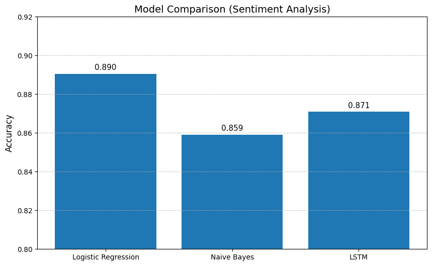

# 🎬 Sentiment Analysis using ML & LSTM

## 📌 Project Overview

This project performs sentiment analysis on IMDB movie reviews using both Machine Learning and Deep Learning techniques.
The goal is to compare the performance of traditional ML models with an LSTM neural network.

---

## 🚀 Models Used

* Logistic Regression
* Naive Bayes
* LSTM (Deep Learning)

---

## 🔧 Techniques & Tools

* Text Cleaning using Regex
* Stopwords Removal (handling negations like "not", "no")
* TF-IDF Vectorization
* Tokenization & Padding
* LSTM for sequence modeling

---

## 📊 Model Performance

This chart shows the accuracy comparison between the models:



---

## 📈 Results

* Logistic Regression Accuracy: 89.0
* Naive Bayes Accuracy: 85.9
* LSTM Accuracy: 87.1

---

## 🧠 Key Learnings

* Understanding the difference between ML and DL in NLP tasks
* Importance of text preprocessing
* Effect of handling negations on model performance
* Comparing TF-IDF vs sequence-based models

---

## 📂 Dataset

* IMDB Dataset (50,000 movie reviews)

---

## ▶️ How to Run

1. Clone the repository:

```bash
git clone https://github.com/abdelrhman_hamada/sentiment-analysis.git
```

2. Install dependencies:

```bash
pip install -r requirements.txt
```

3. Run the notebook:

```bash
jupyter notebook
```

---

## 👨‍💻 Author

**Abdelrahman Hamada**

